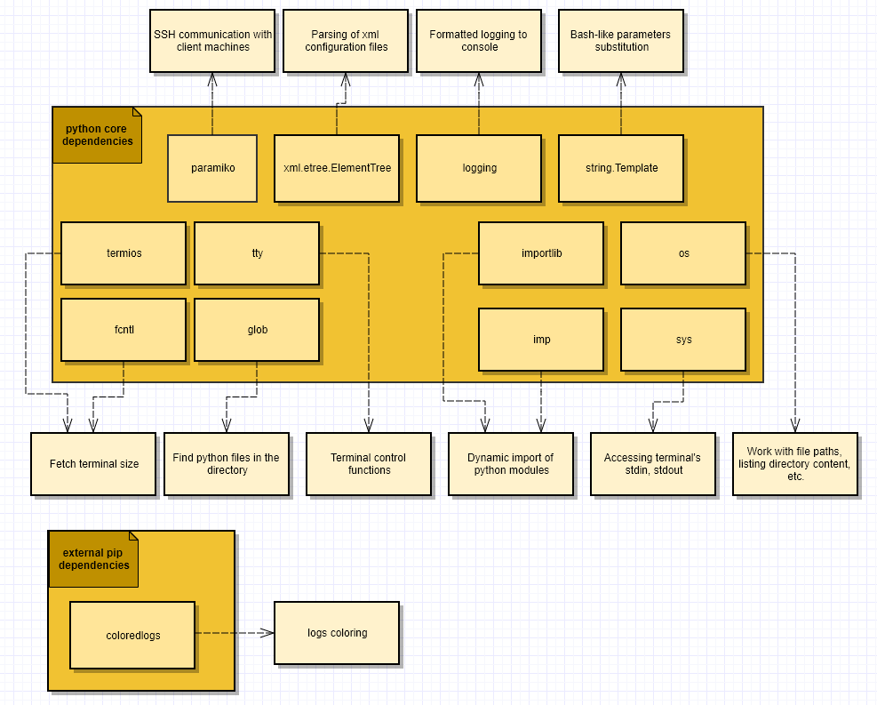
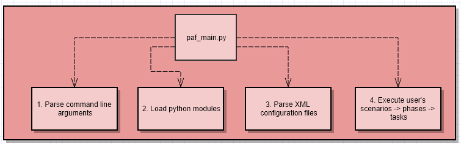

# The PAF framework

## Table of content

- [What is PAF?](#what-is-paf)
- [External dependencies](#external-dependencies)
- [PAF workflow](#paf-workflow)
- [How to declare the task?](#how-to-declare-the-task)
- [The content of the xml configuration file](#the-content-of-the-xml-configuration-file)
- [How to execute PAF scenarios?](#how-to-execute-paf-scenarios)
- [More examples](#more-examples)
- [FAQ](#faq)
- [PAF dependencies](#paf-dependencies)
- [PAF execution workflow](#paf-execution-workflow)

----

## What is PAF?

PAF stands for the "Python automation framework". It is a rather tiny tool, which allows you to create and run your automation scenarios.

----

## External dependencies

PAF framework relies on python3.

On top of that it requires the following set of external python modules:

|Module link|Version|
|---|---|
|[coloredlogs](https://github.com/xolox/python-coloredlogs)|15.0.1+|
|[paramiko](https://docs.paramiko.org/en/stable/)|2.6.0+|

The same list of dependencies can be found [here](./Pipfile). Check the packages section.

In order to install the dependencies, you can choose one of the following ways:

- Install dependencies on your local system:

  ```bash
  pip install coloredlogs
  pip install paramiko
  ```

  The benefit of this option is that you will not need t to execute any additional commands on your system before running PAF. The con is that your system will need to have all the mentioned dependencies on it.

- Set up the virtual environment:

  ```bash
  sudo apt-get install -y pipenv
  cd <this_repo_root>
  pipenv install
  pipenv shell
  ... use the tool ...
  ```

  The benefit of this option is that your system will not have any additional python modules being installed on it. The con is that you will need to call "pipenv shell" from the root folder of this repository before running any PAF commands.

That should be enough to proceed.

----

## PAF workflow

1. Place the root paf folder, which contains the framework's implementation, anywhere you want
2. Create a folder inside the root "./paf" folder, which will contain your developed automation scripts. Let's call it "my_scenarios".
3. Create any number of "*.py" files inside "./paf/my_scenarios/" folder, which will contain your automation scripts. You can create any number of python modules. They all will be dynamically loaded. Still, do not create a complex structure with sub-folders, as such a case is not supported yet.
4. Develop your automation scripts, using the "./paf/paf/paf_impl.py" module. Import it to your scrips and develop the tasks. More information on how to do it is [located here](#how-to-declare-the-task)
5. Create xml file with any name in any location, which will contain parameters and declaration of scenarios and phases. Let's call it scenarios.xml and place it inside the "./paf/my_scenarios/scenarios.xml" folder.
6. Fill in the file with the content. More information on how to do it is [located here](#the-content-of-the-xml-configuration-file)
7. Once both python code and xml configuration are ready to go - start the paf tool, feeding your developed artifacts to it. More information on how to do it is [located here](#how-to-execute-paf-scenarios)

----

## How to declare the task?

The task is a basic building-block, which comtains one or more commands inside itself. You can execute a single task. Beside that you can group one or more tasks inside the phase, and one or more phases inside the scenario. More information on how to do it is [located here](#the-content-of-the-xml-configuration-file).

But, as of now, let's go back to the task. Here is an example of the dummy task, which will call echo:

```python
from paf.paf_impl import logger
from paf.paf_impl import SSHLocalClient

class echo_test(SSHLocalClient):

    def __init__(self):
        super().__init__()
        self.set_name(echo_test.__name__)

    def execute(self):
        output = self.ssh_command_must_succeed("echo ${ECHO_PHRASE}")
        if self.ECHO_PHRASE != output :
            raise Exception(f"Actual output '{output}' is not equal to the expected output '{self.ECHO_PHRASE}'")
        else:
            logger.info(f"Assertion passed. Actual output '{output}' is equal to the expected output '{self.ECHO_PHRASE}'")

```

As you can see, your task is a simple python class, which inherits from the framework's vase classes. The requirements to such class are rather simple:

- It should inherit from paf_impl.Task or one of its sub-classes ( e.g. paf_impl.SSHLocalClient )
- It should declare and imp[lement the "execute" method with no parameters. This method is used by the framework to start the execution of your task
- Such a class should implement the \_\_init\_\_ method, which should:
  - Call the super's init method
  - Pass the name of the task using the self.set_name method

That's all. That simple.

The commands inside your task might be executed using one of the following supported principles:
- via creating a sub-process on the machine, which is executing the PAF scenario
- via SSH connection from the machine, which is executing PAF scenario to one or more target machines

**Note!** In case of the usage of the SSH communication, make sure that the target machine has an established SSH server.

The API of the paf_impl.Task, which should be used by the developer of the scenarios, consists of the following protected methods:

- **subprocess_must_succeed**(**cmd**, **timeout** = 0, **expected_return_codes** = [0], **substitute_params** = True, **shell** = True, **exec_mode** = ExecutionMode.COLLECT_DATA, **communication_mode** = CommunicationMode.PIPE_OUTPUT)

  This method executes a single command as a sub-process. The purpose of this method is to intentionally fail in case of error.

  **Parameters:**

  - **cmd** - the command that will be executed. Might be provided in one of the following forms:
    - if the "shell" parameter is equal to True, the "cmd" parameter can be provided in the form of string or a list. Examples:
      - self.subprocess_must_succeed("echo 123", shell=True)
      - self.subprocess_must_succeed(["echo", "123"], shell=True)
    - if the "shell" parameter is equal to False, the "cmd" parameter can be provided in the form of string. Example:
      - self.subprocess_must_succeed("echo 123", shell=False)
      In this case, providing a list will raise an exception, as it is quite hard to split a complex bash string into a set of arguments.
  - **timeout** - expected duration of the command in seconds. If exceeded, the exception is being raised. Currently this parameter **is ignored** in this call. To be done.
  - **expected_return_codes** - list of the expected returned codes. By default contains only 0 return code. In case if returned code of the cmd is not found in this list - the exception is being raised.
  - **substitute_params** - whether parameters of cmd should be substituted. If set to true, the bash-like parameters substitution will take place. The parameters which take part in substitution are:
    - parameters which are passed from the command line
    - parameters, which are parsed from the xml configuration file
    - parameters, which are injected into the execution environment by the other tasks
    - the fields of the class, which are contained in self.\_\_dict\_\_ collection
  - **shell** - if parameter is equal to True, the "/bin/bash" sub-shell will be created to execute the command. Only in such a mode the "cmd" could be a bash script with pipes, variables, logical operators, etc. Otherwise, the "cmd" should contain **ONLY** call to one executabe with its parameters. Examples:
    - self.subprocess_must_succeed("cd ~/ && echo "Hello, world!" > ./new_file.txt && cat ./new_file.txt", shell=True)
    - self.subprocess_must_succeed("echo 123", shell=False)
    - self.subprocess_must_succeed(["echo", "123"], shell=False)
    **Note!** In case of shell mode, the command will be executed in a subshell, which will not receive certain signals from the OS. E.g. the interactive console application will not react to change of the terminal size. The PAF framework tries to minimize such side-effects. E.g. we modify environment of the running process, so that it contain the size of the terminal once you start the sub-process. Still you might face some side-effects. To avoid them - try to use shell=False for interactive applications.
  - **exec_mode** - executaion mode. Might contain one of the following values:
    - **ExecutionMode.COLLECT_DATA** - will print data to the terminal's stdout. Will process stdin. Will collect stdout and provide it back to the caller, so that the data could be parsed by the calling code
    - **ExecutionMode.INTERACTIVE** - will print data to the terminal's stdout. Will process stdin. Will **NOT** collect stdout. The returned output will be an empty string.
    - **ExecutionMode.DEV_NULL** - will **NOT** print data to the terminal's stdout. Will process stdin. Will **NOT** collect stdout. The returned output will be an empty string.
    **Note!** Be aware that in case of usage of the **communication_mode = CommunicationMode.USE_PTY** the stderr and stdout would be mixed inside the returned output string. There is no way to distinguish between them in such a case.
  - **communication_mode** - specifies one of the supported communication modes. Can take one of the following values:
    - CommunicationMode.USE_PTY - will redirect output to a **pseudo-terminal pair**. The executed sub-process will think, that it is executed **inside a tty**. Some applications, e.g. anroid repo tool will print a progress only in such a mode, and will omit it in CommunicationMode.PIPE_OUTPUT.
    - CommunicationMode.PIPE_OUTPUT - will pipe all output **without** usage of the additional PTY. The executed sub-process will think, that it is **NOT running in a tty**. Some applications, e.g. make, will not send console escape sequences in such a case. In this mode the output would be a build log, which you can put to a file. The one, where each next directive will not "overwrite" the previous one.

  **Returns:**
  Command output as a string.

- **exec_subprocess**(**cmd**, **timeout** = 0, **substitute_params** = True, **shell** = True, **exec_mode** = ExecutionMode.COLLECT_DATA, **communication_mode** = CommunicationMode.PIPE_OUTPUT)

  This method executes a single command as a sub-process. The purpose of this method is to return all details back to the client even in case of command failure.

  **Parameters:**

  - **cmd** - the command that will be executed. Might be provided in one of the following forms:
    - if the "shell" parameter is equal to True, the "cmd" parameter can be provided in the form of string or a list. Examples:
      - self.subprocess_must_succeed("echo 123", shell=True)
      - self.subprocess_must_succeed(["echo", "123"], shell=True)
    - if the "shell" parameter is equal to False, the "cmd" parameter can be provided in the form of string. Example:
      - self.subprocess_must_succeed("echo 123", shell=False)
      In this case, providing a list will raise an exception, as it is quite hard to split a complex bash string into a set of arguments.
  - **timeout** - expected duration of the command in seconds. If exceeded, the exception is being raised. Currently this parameter **is ignored** in this call. To be done.
  - **substitute_params** - whether parameters of cmd should be substituted. If set to true, the bash-like parameters substitution will take place. The parameters which take part in substitution are:
    - parameters which are passed from the command line
    - parameters, which are parsed from the xml configuration file
    - parameters, which are injected into the execution environment by the other tasks
    - the fields of the class, which are contained in self.\_\_dict\_\_ collection
  - **shell** - if parameter is equal to True, the "/bin/bash" sub-shell will be created to execute the command. Only in such a mode the "cmd" could be a bash script with pipes, variables, logical operators, etc. Otherwise, the "cmd" should contain **ONLY** call to one executabe with its parameters. Examples:
    - self.subprocess_must_succeed("cd ~/ && echo "Hello, world!" > ./new_file.txt && cat ./new_file.txt", shell=True)
    - self.subprocess_must_succeed("echo 123", shell=False)
    - self.subprocess_must_succeed(["echo", "123"], shell=False)
    **Note!** In case of shell mode, the command will be executed in a subshell, which will not receive certain signals from the OS. E.g. the interactive console application will not react to change of the terminal size. The PAF framework tries to minimize such side-effects. E.g. we modify environment of the running process, so that it contain the size of the terminal once you start the sub-process. Still you might face some side-effects. To avoid them - try to use shell=False for interactive applications.
  - **exec_mode** - executaion mode. Might contain one of the following values:
    - **ExecutionMode.COLLECT_DATA** - will print data to the terminal's stdout. Will process stdin. Will collect stdout and stderr, and provide them back to the caller, so that the result data could be parsed.
    - **ExecutionMode.INTERACTIVE** - will print data to the terminal's stdout. Will process stdin. Will **NOT** collect stdout and stderr. The returned output will be empty strings.
    - **ExecutionMode.DEV_NULL** - will **NOT** print data to the terminal's stdout. Will process stdin. Will **NOT** collect stdout and stderr. The returned output will be empty strings.
    **Note!** Be aware that in case of usage of the **communication_mode = CommunicationMode.USE_PTY** the stderr and stdout would be mixed inside the paf_impl.SubprocessCommandOutput.stdout. There is no way to distinguish between them in such a case.
  - **communication_mode** - specifies one of the supported communication modes. Can take one of the following values:
    - CommunicationMode.USE_PTY - will redirect output to a **pseudo-terminal pair**. The executed sub-process will think, that it is executed **inside a tty**. Some applications, e.g. anroid repo tool will print a progress only in such a mode, and will omit it in CommunicationMode.PIPE_OUTPUT.
    - CommunicationMode.PIPE_OUTPUT - will pipe all output **without** usage of the additional PTY. The executed sub-process will think, that it is **NOT running in a tty**. Some applications, e.g. make, will not send console escape sequences in such a case. In this mode the output would be a build log, which you can put to a file. The one, where each next directive will not "overwrite" the previous one.

  **Returns:**
  An instance of the paf_impl.SubprocessCommandOutput class, which contains the following fields:
  - stdout - output of the command as a string
  - stderr - the content of stderr stream as a string
  - exit_code - exit code of the command

- **ssh_command_must_succeed**(**cmd**, **host**, **user**, **port** = 22, **password** = "", **key_filename** = "", **timeout** = 0, **expected_return_codes** = [0], **substitute_params** = True, **exec_mode** = ExecutionMode.COLLECT_DATA)

  This method executes a single command on side of the SSH server. The purpose of this method is to intentionally fail in case of error.

  **Parameters:**
  - **cmd** - the command which is sent to the SSH server. A bash-like one-liner command is expected here. It might be rather complex and include pipes, variables, usage of "and" and "or" operators, etc.
  - **host** - IP address of the target machine, on which the command will be executed
  - **user** - the name of the user, which will be used to authenticate to the target machine
  - **port** - the port, which would be used for communication with the target machine. By default an SSH port 22 is used
  - **password** - the password, which will be used to authenticate to the target machine. Might be empty, in case if "key_filename" parameter is provided
  - **key_filename** - path to the SSH key, which would be used for authentication to the target system
  - **timeout** - expected duration of the command in seconds. If exceeded, the exception is being raised
  - **expected_return_codes** - list of the expected returned codes. By default contains only 0 return code. In case if returned code of the cmd is not found in this list - the exception is being raised.
  - **substitute_params** - whether parameters of cmd should be substituted. If set to true, the bash-like parameters substitution will take place. The parameters which take part in substitution are:
    - parameters which are passed from the command line
    - parameters, which are parsed from the xml configuration file
    - parameters, which are injected into the execution environment by the other tasks
    - the fields of the class, which are contained in self.\_\_dict\_\_ collection
  - **exec_mode** - executaion mode. Might contain one of the following values:
    - **ExecutionMode.COLLECT_DATA** - will print data to the terminal's stdout. Will process stdin. Will collect stdout and provide it back to the caller, so that the data could be parsed by the calling code
    - **ExecutionMode.INTERACTIVE** - will print data to the terminal's stdout. Will process stdin. Will **NOT** collect stdout. The returned output will be an empty string.
    - **ExecutionMode.DEV_NULL** - will **NOT** print data to the terminal's stdout. Will process stdin. Will **NOT** collect stdout. The returned output will be an empty string.

  **Returns:**
  Command output as a string.

- **exec_ssh_command**(**cmd**, **host**, **user**, **port** = 22, **password** = "", **key_filename** = "", **timeout** = 0, **substitute_params** = True, **exec_mode** = ExecutionMode.COLLECT_DATA)

  This method executes a single command on side of the SSH server. The purpose of this method is to return all details back to the client even in case of command failure.

  **Parameters:**
  - **cmd** - the command which is sent to the SSH server. A bash-like one-liner command is expected here. It might be rather complex and include pipes, variables, usage of "and" and "or" operators, etc.
  - **host** - IP address of the target machine, on which the command will be executed
  - **user** - the name of the user, which will be used to authenticate to the target machine
  - **port** - the port, which would be used for communication with the target machine. By default an SSH port 22 is used
  - **password** - the password, which will be used to authenticate to the target machine. Might be empty, in case if "key_filename" parameter is provided
  - **key_filename** - path to the SSH key, which would be used for authentication to the target system
  - **timeout** - expected duration of the command in seconds. If exceeded, the exception is being raised.
  - **substitute_params** - whether parameters of cmd should be substituted. If set to true, the bash-like parameters substitution will take place. The parameters which take part in substitution are:
    - parameters which are passed from the command line
    - parameters, which are parsed from the xml configuration file
    - parameters, which are injected into the execution environment by the other tasks
    - the fields of the class, which are contained in self.\_\_dict\_\_ collection
  - **exec_mode** - executaion mode. Might contain one of the following values:
    - **ExecutionMode.COLLECT_DATA** - will print data to the terminal's stdout. Will process stdin. Will collect stdout and stderr, and provide them back to the caller, so that the result data could be parsed.
    - **ExecutionMode.INTERACTIVE** - will print data to the terminal's stdout. Will process stdin. Will **NOT** collect stdout and stderr. The returned output will be empty strings.
    - **ExecutionMode.DEV_NULL** - will **NOT** print data to the terminal's stdout. Will process stdin. Will **NOT** collect stdout and stderr. The returned output will be empty strings.

  **Returns:**
  An instance of the paf_impl.SSHCommandOutput class, which contains the following fields:
  - stdout - output of the command as a string
  - stderr - the content of stderr stream as a string
  - exit_code - exit code of the command

----

## The content of the xml configuration file

The PAF framework is configured using the xml files of a certain format. You can feed any number of the xml configuration files to PAF framework, which it will consider during the execution phase. Use "-c" "--config" parameter in order to specify a single path to the configuration file:

```bash
python ./paf/paf_main.py -imd ./paf/my_scenarios -c ./paf/my_scenarios/scenarios.xml -s echo_test
```

Multiple occurrences of the parameter will be considered as multiple files, which should be applied during the execution. Configuration files are parsed in order of their occurrence in the command line.

Here is what would be the content of the xml file to write our "echo_test" task:

```xml
<paf_config>

    <!--Predefined PAF parameters for connection to the local system-->
    <param name="LOCAL_HOST_IP_ADDRESS" value="127.0.0.1"/>
    <param name="LOCAL_HOST_USER_NAME" value="vladyslav_goncharuk"/>
    <param name="LOCAL_HOST_SYSTEM_SSH_KEY" value="/home/vladyslav_goncharuk/.ssh/id_rsa"/>
    <!-- Better not to use password parameter. Use RSA instead. Still, it is supported. -->
    <!-- <param name="LOCAL_HOST_SYSTEM_PASSWORD" value="xyz"/> -->

    <param name="ECHO_PHRASE" value="Hello, world!"/>
    <phase name="echo_test">
        <task name="my_scenarios.my_scenarios.echo_test"/>
    </phase>
    <scenario name="echo_test">
        <phase name="echo_test"/>
    </scenario>
</paf_config>
```

The following tags are currently supported:

- The root **"paf_config"** tag - simply the mandatory root tag, which contains all the other tags.

- The **"param"** tag - specifies the "key - value" pair, that can be accessed from within the task. In our case, we have a single parameter which is called ECHO_PHRASE. For sure you can declare a lot more of them.

  You can access your parameters by multiple ways from the code of your tasks:

    * Via accessing it as a field:
      ```python
      self.ECHO_PHRASE
      ```
      That is possible as all tasks will have all parameters being injected to their self.\_\_dict\_\_ collection.

    * Via using the bash-like parameters substitution inside the paf's API:
      ```python
      output = self.ssh_command_must_succeed("echo ${ECHO_PHRASE}")
      ```
      That is possible due to the usage of the string. Template abstraction from python core lib-s.

  As you can see above, the "param" tag supports 2 following mandatory attributes:

  - name - the name of the parameter. Only strings are allowed.
  - value - the value of the parameter. Only strings are allowed.


- The root **"phase"** tag - the phase can be considered as a collection of the tasks, which should be executed sequentially one after another.

  The phase tag supports the following mandatory attributes:
    - name - the name of the phase. Used in other places as an access key to the phase.

  The "phase" tag may contain the following sub-tags:
    - task - can be mentioned multiple times, specifying the task name to be executed:
      ```xml
      <phase name="echo_test">
          <task name="my_scenarios.my_scenarios.task_1"/>
          <task name="my_scenarios.my_scenarios.task_2"/>
          <task name="my_scenarios.my_scenarios.task_3"/>
      </phase>
      ```

      Besides that each "task" inside the "phase" tag can contain an optional "condition" tag, with mandatory "name" and "value" attributes:
      ```xml
      <phase name="echo_test">
          <task name="my_scenarios.my_scenarios.task_1"/>
          <task name="my_scenarios.my_scenarios.task_2">
              <condition name="EXECUTE_TASK_2" value="True"/>
          </task>
          <task name="my_scenarios.my_scenarios.task_3 "/>
      </phase>
      ```
      In the above example the task "my_scenarios.my_scenarios.task_2" will be executed only if the execution environment has a parameter EXECUTE_TASK_2 with value "True". To have that parameter available you can:
        - Declare it in the same xml file via the "param" tag
        - Pass it to the PAF using the "-p" "--parameter" console argument:
          ```
          -p EXECUTE_TASK_2=True
          ```
        - Add additional parameters in one of the previous tasks. E.g. the task "my_scenarios.my_scenarios.task_1" depending on its flow might set the additional parameter:
          ```
          self.set_environment_param("EXECUTE_TASK_2", "True")
          ```

        In such case, the environment would be extended with the new parameter, and all next tasks will receive it and will be able to use it.

      **Note!** In the case of multiple conditions for a single task, the AND logical operator is used. Meaning that the task will be executed only if ALL conditions are met.

- The **"scenario"** tag - the scenario can be considered as a collection of the phases, which should be executed sequentially one after another.

  The scenario tag supports the following mandatory attributes:
    - name - the name of the scenario

  The "scenario" tag may contain the following sub-tags:
    - phase - can be mentioned multiple times, specifying the phase name to be executed:
      ```xml
          <scenario name="echo_test">
             <phase name="phase_1"/>
             <phase name="phase_2"/>
             <phase name="phase_3"/>
          </scenario>
      ```

      Besides that each "phase" inside the "scenario" tag can contain a "condition" tag:
      ```xml
          <scenario name="echo_test">
              <phase name="phase_1"/>
              <phase name="phase_2">
                  <condition name="EXECUTE_PHASE_2" value="True"/>
              </phase>
              <phase name="phase_3"/>
          </scenario>
      ```

      The condition logic here is totally the same, as in the root "phase" tag. The phase will be executed if the execution environment will have the mentioned parameter, with the same value.

----

## How to execute PAF scenarios?

Currently, the tool supports the following set of command line options:

|Parameter|Comment|Allowed number of occurences|
|---|---|---|
|-t, --task|Task to be executed|Multiple|
|-s, --scenario|Scenario to be executed|Multiple|
|-ph, --phase|Phase to be executed|Multiple|
|-c, --config|Apply this XML configuration file|Multiple|
|-p, --parameter|Add parameter to the execution context|Multiple|
|-imd, --import_module_dir|Load all python modules from the specified directory|Multiple|
|-ld, --log-dir|Store the output to the specified directory|Last win|

The typical command to execute PAF scenario would be:

```bash
python ./paf/paf_main.py -imd ./paf/my_scenarios -c ./paf/my_scenarios/scenarios.xml -s echo_test -p ECHO_PHRASE="Overriden echo phrase!" -ld="./"
```

----

## More examples

You can find the example automation project at the [following page](./linux_deployment)

----

## FAQ

**Q:** Does PAF supports interactive input?

**A:** For SSH transport, PAF supports interactive input within each separately executed command. E.g. each call of the SSHLocalClient's "ssh_command_must_succeed" and "exec_ssh_command" methods will be interactive. Still, between the calls, the channel will be re-opened, which would cause certain limitations, e.g. environment variables are not being saved, or sudo password is not remembered.

**Q:** Why sudo password is being asked on each SSH command execution? Is the connection re-opened on each command?

**A:** No, the connection is not re-opened on each call. So there are no multiple attempts to log in onto your machine. Still, the channel is re-opened on each command, which causes "sudo password not being remembered" use case. This is a limitation of SSH. In order to reliably get the exit code of each command, we need to use the exec mode of SSH communication. In that mode, the channel is being closed after the command execution. Once, the framework will be extended, we will introduce separate calls for non-SSH with the local system. There the "sudo password memory" behavior will meet the client's expectations.

**Q:** Are there any predefined parameters, which are used by the framework?

**A:** Yes, there are couple of such parameters:

|Parameter|Comment|
|---|---|
|LOCAL_HOST_IP_ADDRESS|IP address of the local system. It is obviously 127.0.0.1. Still, you might have a need to run your scenarios on another machine. Due to that it is possible to configure it.|
|LOCAL_HOST_USER_NAME|User name to be used for authentication to the local system|
|LOCAL_HOST_SYSTEM_SSH_KEY|The full path to the private SSH key, which will be used for authentication to the local system|
|LOCAL_HOST_SYSTEM_PASSWORD|The password, which will be used for authentication to the local system. Better not to use this parameter and prefer usage of the SSH key|

**Note!** Above-mentioned local host parameters are used by the paf_impl.SSHLocalClient class. If you are not using it - you can avoid specifying them.

----

## PAF dependencies

The below diagram contains the dependencies of PAF frameworkd to the other python modules:



----

## PAF execution workflow

The below diagram contains high-level description of the PAF's execution flow:


